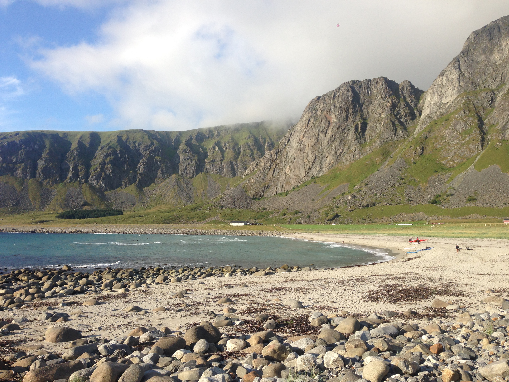

# BuildingAIprojectIDEA
Building AI course project
<!-- This is the markdown template for the final project of the Building AI course, 
created by Reaktor Innovations and University of Helsinki. 
Copy the template, paste it to your GitHub README and edit! -->

# Project Title

Final project for the Building AI course

## Summary

Describe briefly in 2-3 sentences what your project is about. About 250 characters is a nice length! 

My project is about saving the beaches all around the world. The beaches must be open for public. Especially those beaches where you can surf! :)


## Background

Which problems does your idea solve? How common or frequent is this problem? What is your personal motivation? Why is this topic important or interesting?

This is more like at an imaginary problem where you might find that your favourite beach is very busy and occupied when you get there. So it would be really greate to book some beach time, but only for a short while. No one should be able to book the beach for a long time, and there should be a system that you only can do it so much in a given periode of time.


This is how you make a list, if you need one:
* problem 1: Establish permissions to do such booking. Maybe only for a few select places around.
* problem 2: Set uo the booking system. Maybe with a small fee for booking and reservation. And a secure login and identification system.
* etc.


## How is it used?

Describe the process of using the solution. In what kind of situations is the solution needed (environment, time, etc.)? Who are the users, what kinds of needs should be taken into account?

This would be an online system, web page and app.


Images will make your README look nice!
Once you upload an image to your repository, you can link link to it like this (replace the URL with file path, if you've uploaded an image to Github.)


If you need to resize images, you have to use an HTML tag, like this:


This is how you create code examples:
```
def main():
   countries = ['Denmark', 'Finland', 'Iceland', 'Norway', 'Sweden']
   pop = [5615000, 5439000, 324000, 5080000, 9609000]   # not actually needed in this exercise...
   fishers = [1891, 2652, 3800, 11611, 1757]

   totPop = sum(pop)
   totFish = sum(fishers)

   # write your solution here

   for i in range(len(countries)):
      print("%s %.2f%%" % (countries[i], 100.0))    # current just prints 100%

main()
```


## Data sources and AI methods
Where does your data come from? Do you collect it yourself or do you use data collected by someone else?

There is need for user data, linking to weather data base, forecasts and such.

If you need to use links, here's an example:
[Twitter API](https://developer.twitter.com/en/docs)

| Syntax      | Description |
| ----------- | ----------- |
| Header      | Title       |
| Paragraph   | Text        |

## Challenges

What does your project _not_ solve? Which limitations and ethical considerations should be taken into account when deploying a solution like this?

If you book the beach in a long time ahead, you cannot be too sure about the weather. That is a chance you will need to take.

## What next?


How could your project grow and become something even more? What kind of skills, what kind of assistance would you  need to move on? 

Need to contact local government who apply rules for this kind of stuff. Then there is need for some good programmers to set up the system. And there need to be physical signs and information about bookin for the (surf) spot and time.


## Acknowledgments

* list here the sources of inspiration 
* do not use code, images, data etc. from others without permission
* when you have permission to use other people's materials, always mention the original creator and the open source / Creative Commons licence they've used
  <br>For example: [Sleeping Cat on Her Back by Umberto Salvagnin](https://commons.wikimedia.org/wiki/File:Sleeping_cat_on_her_back.jpg#filelinks) / [CC BY 2.0](https://creativecommons.org/licenses/by/2.0)
* etc
